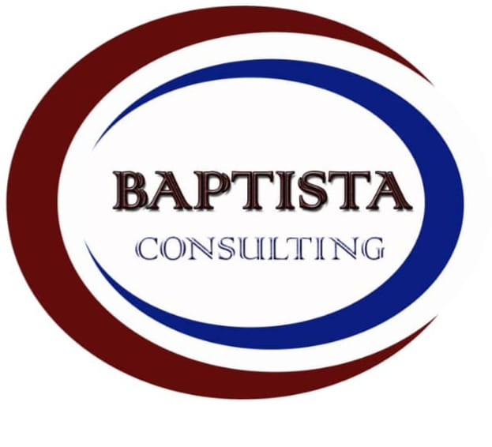

1
100%

  

<h1 align="center">Chinwendu Marybaptista Nwachukwu</h1>
<h3 align="center">AI Automation Expert, Workflow Consultant, IT Engineer, Founder at Baptista Global Resources NIG LTD</h3>

  
  
  

---

## What I Do

I help businesses stop doing things manually. I design and build AI-powered automation systems, CRM integrations, cloud infrastructure, and workflow pipelines that save time, reduce errors, and scale operations without needing a full dev team.

My background spans Electrical and Electronic Engineering (OND, HND, PGD) and an MBA in Management, which means I approach technical problems with both an engineering mindset and a business perspective.

---

## Tech Stack and Tools

**Automation and No-Code:** Make.com, Zapier, n8n, GoHighLevel, Airtable, Monday.com, Notion, Jira

**CRM and Sales Tools:** HubSpot, Salesforce, Zendesk, Apollo, Lemlist

**Cloud and DevOps:** AWS, Microsoft Azure, GCP, Terraform (HCL), Kubernetes, Docker, CI/CD

**Development:** Python, JavaScript, Java, Shell/Bash, HTML/CSS, REST APIs

**AI and Data:** Claude AI, Grok, Prompt Engineering, GoHighLevel AI Agents, Data Analysis

---

## Featured Projects

**Full-Stack Online Banking Application**

Built a complete banking application with separate frontend and backend services, containerised with Kubernetes and deployed on cloud infrastructure.
Frontend: JavaScript; Backend: Java; Infrastructure: Kubernetes and AWS S3.
Repos: main_bank_app_frontend, main_bank_app_backend, S-bucket (CloudForge13 org)

**AWS Three-Tier Architecture, Terraform Deploy**

Designed and deployed a production-grade AWS three-tier architecture using Terraform (HCL). Infrastructure as Code, built from scratch.
Repo: aws-three-tier-terraform-deploy (CloudForge13 org)

**Kubernetes Manifest Collection**

Managed Kubernetes manifests for multi-service deployments, covering deployments, services, config maps, and ingress rules.
Repo: kubernetes-manifest (CloudForge13 org)

**Portfolio Website**

Personal portfolio site built in HTML and deployed via GitHub Pages and Netlify.
Live: https://chinwendu-nwachukwu-portfolio.netlify.app
Repo: Chinwendu-Nwachukwu-Portfolio

**COVID-19 Nigeria Dataset**

Compiled and published a dataset covering all 36 Nigerian states for public research use.
Repo: Covid-19-Dataset-for-Nigeria

**AI Receptionist Agent (GoHighLevel)**

Built "Bella", a voice AI receptionist for Baptista Global Resources using GoHighLevel's AI agent feature, complete with knowledge base, trigger prompts, and test scenarios.

**Lead Nurture Automation System**

Built a full multi-email lead nurture sequence using Make.com, Tally, Google Sheets, and Gmail. Zero manual follow-up after a lead opts in.

---

## About Baptista Global Resources NIG LTD

A Nigerian technology consultancy helping businesses grow through AI automation, CRM integration, cloud solutions, and digital strategy. Founded in Port Harcourt, Nigeria. RC No: 7875862.

Services: Workflow Automation, CRM Integration, Cloud and DevOps, IT Support, Data Analysis, Personal Branding, Tech Mentorship

---

## GitHub Stats

  

  

---

## Certifications and Training

Software Engineering, ALX Africa; DevOps and Cloud Security; AI and Career Essentials, ALX Africa; Project Management Professional (PMP); Social Media Marketing; HSE 1, 2, 3

---

## Let's Connect

Open to consulting projects, remote roles, and collaborations in automation, cloud infrastructure, and AI integration. If you're a startup founder or executive who needs systems that actually work, let's talk.

Book a Discovery Call: https://calendly.com/chinwendunwachukwu/1-1-discovery-call

---

*"I make complex systems simple so businesses can grow without burnout."*
